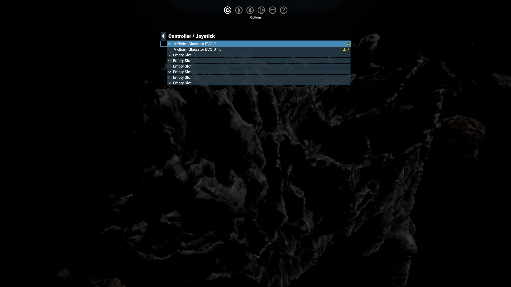
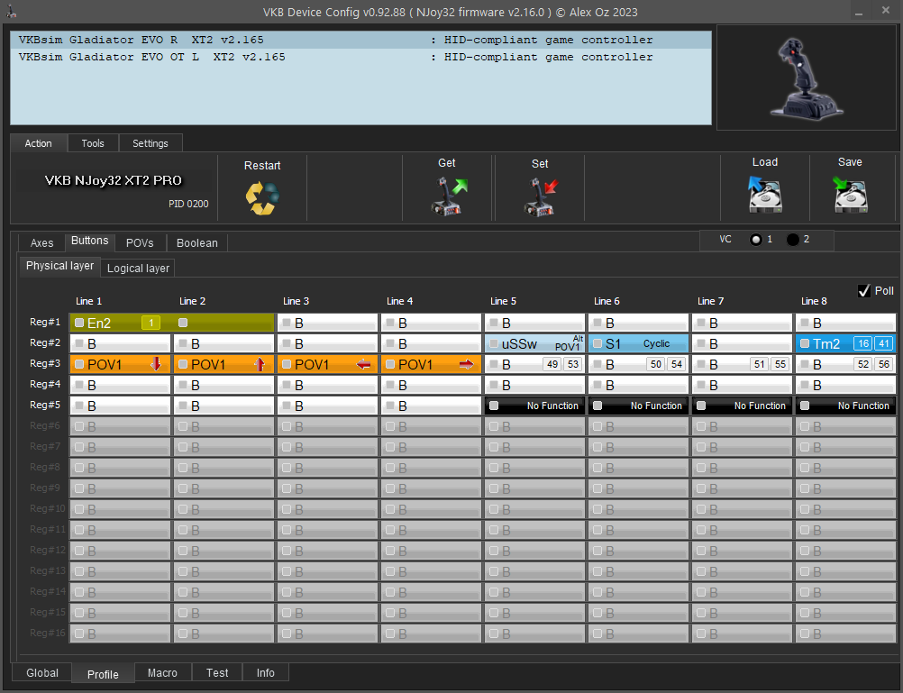
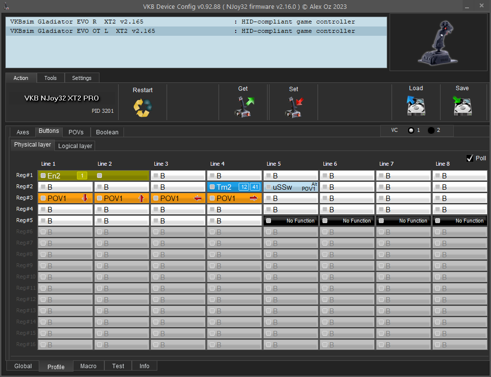

# X4: Foundations VKB Gladiator NTX EVO Configuration

## WARNING

MAKE SURE YOU HAVE BACKUPS OF YOUR VKB CONFIG FILES AND X4 INPUT MAPS BEFORE YOU USE THESE SCRIPTS.  THE AUTHOR IS NOT RESPONSIBLE IF YOUR ONE AND ONLY COPY OF A FILE IS RUINED.

## Introduction

This is my personal dual stick configuration of the [VKB Gladiator NTX EVO](https://www.vkbcontrollers.com/) joysticks for [X4: Foundations by Egosoft](https://www.egosoft.com).

Many of the buttons on the sticks are not yet bound to in-game functions.  This is a work-in-progress and as I get more time with the sticks I will probably move things around.  See the CHANGELOG below for more details.

This is built around two VKB Gladiator NTX EVO joysticks.  Both sticks use the premium grip.  The right hand stick is in the vertical configuration and used as the main directional stick.  The left hand stick is in the Omni Throttle configuration with the Y axis spring removed.

I do not know if you can use my config files and apply them to the opposite hands without needing to modify it first.  If you can't, see the details below on how I've configured the sticks.

## Instructions

### VKB Gladiator NTX Evo

Place the two `VKB*.cfg` in the folder with your VKB software.

Using the VKB configuration software, send the two configuration files to your joysticks.

### X4: Foundations

Place the input map file in your `Egosoft/X4/{random_number}` folder.  Rename the file to `inputmap_#.xml` where the number is a number 1-5.  For best results use a number that is currently not being used by other input maps.

The input map should work both right and left handed as long as you keep the same stick configuration numbers as I do.

Your flight stick should be set as controller 1.

Your throttle stick should be set as controller 2.

In the X4 Controls menu use the Load Profile option to load the new configuration.

### Scripts

There are two scripts I wrote to help me move files around.  In the `.env_template` file you will see the environment variables used in the two scripts.  If you use `dotenv`, renaming this to `.env` and filling out the `replace_me` fields should allow you to use these scripts as well

`copy_from_local.sh` Is used to copy the VKB config and X4 Input map from my local machine folders to the source code folder.  I used this after I make changes and want to sync this to GitHub.

`copy_to_local.sh` Is used this to copy the files from the source code folder into place on my local machine.  It will attempt to create a time stamp backup in your destination folder before copying the files.

## Configuration

### VKB

#### Right Hand (Flight Control)

|Cell|Button|Virtual Button(s)|Function|Notes|
|---|---|---|---|---|
|Line 8 / Reg 2|B1|#16, #41|Tempo 2, short #16, long #41||
|Line 6 / Reg 2|A3 Push|#14|Cycle Modes 00 -> 01 -> 02|The RGB LED switches Blue -> Green -> Red per mode|
|Line 5 / Reg 3|A3 Down|#21, #49, #53|Modes 00 -> 01 -> 02||
|Line 6 / Reg 3|A3 Up|#22, #50, #54|Modes 00 -> 01 -> 02||
|Line 7 / Reg 3|A3 Left|#23, #51, #55|Modes 00 -> 01 -> 02||
|Line 8 / Reg 3|A3 Right|#24, #52, #56|Modes 00 -> 01 -> 02||

##### Description

There are two main changes on the flight stick.  

First, `B1` is a Tempo button with short and long configured as two virtual buttons.

Second, `A3 Push` cycles through all three shift modes.  I'll go into further detail about the 3 modes in the X4 configuration section.  Shift mode 0 (default) has the led blue, Shift mode 1 will change the led to Green and is used for civilian deployables. Shift mode 2 will change the led to red and is used for combat deployables and orders.

#### Left Hand (Throttle Control)

|Cell|Button|Virtual Button(s)|Function|Notes|
|---|---|---|---|---|
|Line 4 / Reg 2|A2|#12, #41|Tempo 2, short #12, long #41||

Additionally the RGB LED is configured to flash red when the Y axis is in the center and solid green when it is not.  This has the effect that when your ship throttle is set to 0 you see a flashing red light and solid green while in motion.  I'm able to see the flashing in my peripheral vision so I've found this to be a useful indicator.

### X4: Foundations InputMap

My overall philosophy was to try and find a control scheme that allowed for great flight controls and made first person movement a breeze from the sticks.  On top of that, I've tried to group buttons and functions together as logically as I can.  I leverage Shift Modes to achieve some of these grouping.  I've tried to put my most common controls in locations for the easiest access.

On the left hand stick `D1` (pinkie) is mapped to Pause.  The fact that X4 allows you to pause at any time and issue orders via the map, makes this placement very convenient for very regular use.  

If you aren't pausing your game in the middle of a dogfight because you suddenly had a great idea for a good station to build, then are you REALLY an X4: Foundations player? 🤣

#### General UI

These will get repeated below, but I'm going to call them out here as well.

On the right hand stick the `A2` is your primary interact/action/left-mouse-click button.

On the right hand stick the `B1` is use to back out of your current menu.

The `C1 Hat` directions are used to navigate around menus.  Combine this with `A2` and you should be flying through the UI in no-time.

#### First Person Movement And Interactions

I've attempted to create a configuration that should feel natural to anyone who plays FPS games with game console controllers.

If you click the `A1 HAT` switch on both the left and right controllers it will put these two sticks into analog mode.  The small red led indicator light should be turned on.  I've configured movement and your head movement on these two sticks to be the same as you would find in just about any First Person Shooter using an X-Box or PlayStation controller.  If you regularly play these types of games using a controller, then using your thumbs on these two sticks should feel pretty natural.

Feel free to invert axis and tweak sensitivity to your liking.  Just be aware that if you ever download an updated version of my configs to use, you'll have to reconfigure those to your preferences.

The `A2` button on the right stick is mapped to interact.  Consider this your replacement for your regular mouse click.  Use this to talk to people, use elevators, and just about anywhere that you'd reach over to your mouse to click.

The `B1` button can be used to back out of menus.  Consider it the same a the `ESC`.

Using the `C1 Hat` directions, you should be able to successfully walk up to the trade desk at any station, ask to see wares, buy and sell something, and then leave all without ever having to move your hands to your mouse.

#### Map

I am still working on this.  Right now clicking the middle button on the right hand `C1 Hat` will open the menu.  You can then use the menu navigation Hat controls and the `A2` and `B1` to move around.  But that's about it so far.  This is not optimized at all.

#### Flight

##### Movement Basics

The right hand stick is used for flight.  The Y axis is mapped to pitch, the X axis is mapped to roll, and the Z rotation on the handle is mapped to yaw.  This should be standard for most flight simulations.  

The left hand stick is used for throttle and strafing.  I've removed the Y axis spring so that the dry clutch converts this axis into a throttle.  

Y axis is throttle positive and negative.  The RGB leg will flash red in the zero position to indicate you've stopped.  Solid green indicates you are under thrust.

X axis will do left/right strafing.  The Z handle rotation for up/down.

On the left hand stick `A2` is configured as a Tempo button.  Short press will turn off engines (full stop) and long press engages the boost.

On the left hand stick `C1 Hat Press` will toggle Flight Assist.  Use this to pull sick drifts in travel drive mode.

##### Ship Modes

Use the `C1 Hat` directions to toggle the various ship modes.  

- `Left` -- Travel Drive
- `Up` -- Scan Mode
- `Down` -- Long Range Scan Mode
- `Right` -- Seta

Note: In the Omni Throttle angled configuration this actually places the `Left` direction in much more of an `Up` direction and this makes it very easy to use your thumb to switch into this mode.  Travel is my most common mode and I suspect it is yours as well.

- `C1 Hat Press` toggles flight assist.
- Left hand `Main Trigger` hold and release while in Long Range Scan mode to send out a ping.
- Right hand `B1` short press triggers Ship Scan.

##### Targeting

The left hand `A4 Hat` directions perform the following targeting options.

- `Up` -- Target object
- `Down` -- Target nearest enemy
- `Left` -- Engage Autopilot
- `Right` -- Set Guidance
- `Press` -- Deselect Target

Note: In the Omni Throttle configuration `Left` is in more of an `Up` direction.  

With this configuration you could be able to `Up` to target a station or ship, `Right` to set guidance to it (the Yellow highlight box) and then `Left` to trigger auto-pilot to take you there.

##### Combat

Note: I haven't been able to figure out a way to configure the Fire Button 2 to anything within the X4 ui.  So for now I have them unmapped.  I'm still trying to figure out where they'd be useful as well.  Right now the only good idea I have is triggering space suit bombs, but even then I'm not sure.

The main trigger buttons for both sticks are mapped to Primary and Secondary fire.  Right hand is primary, and left hand is secondary.  While in long range scan mode, the left hand trigger performs the release and hold ping.

On the right hand and left hand sticks, rapid fire `Up` will cycle through the associated primary and secondary weapon groups.  

On the right hand stick, rapid fire `Down` will release countermeasures.

On the left hand stick, rapid fire `Down` will load the next missile type.  

After combat, long pressing the `B1` Tempo button engages the container magnet.

##### Right Hand A3 Modes

I decided to use the right hand `A3 Hat` for 3 separate modes focused around deployables and commands in different situations.  Center clicking the `A3 Hat` will cycle between modes 00 -> 01 -> 02.

To help you I've configured each mode to display a different color.  Mode 00 is blue, 01 is green, and 02 is red.

Mode 00 General

- `Left` -- Request Docking / Undocking
- `Up` -- Get Up

Mode 01 is green and focused on civilian deployables.  

- `Left` -- Navigation Beacon
- `Up` -- Resource Probe
- `Right` -- Satellite
- `Down` -- Not mapped

Mode 02 is red and focused on combat orders and deployables.

- `Left` -- Toggle Drone Deployment
- `Up` -- Wingman attack target
- `Right` -- Disable Turrets
- `Down` -- Deploy Laser Tower

I've never really played with mines so that's why I don't have it mapped.  Although now that I've got a lot more button options I may revisit this.

I tend to toggle turrets a lot when I'm in M sized ships when I'm close to NPC stations or larger ships to help prevent splash damage and reputation loss.

## Changelog

- 2024.01.28 -- Initial Release
