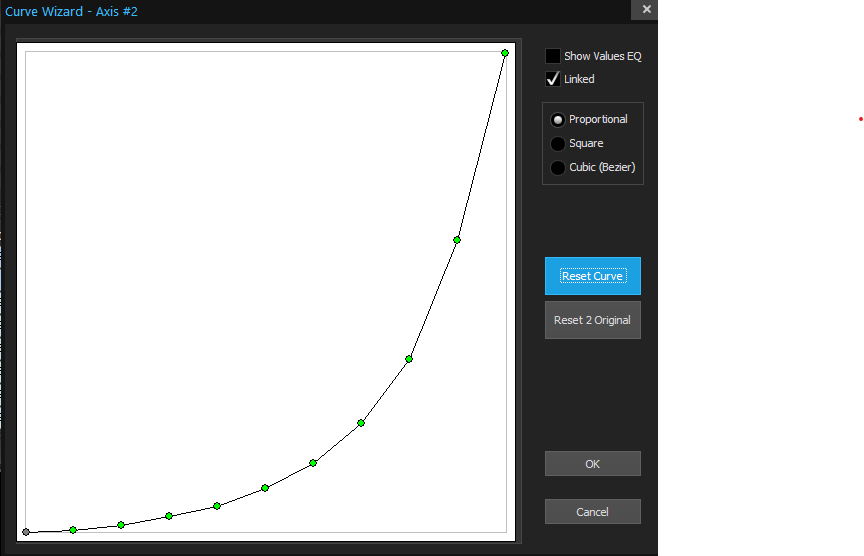
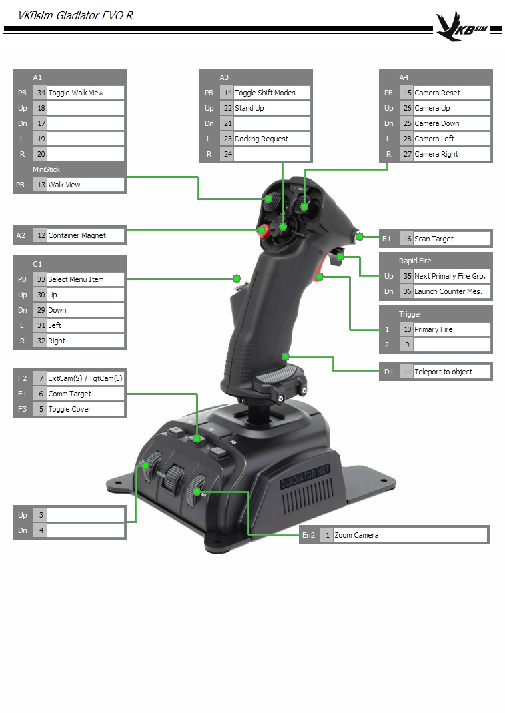
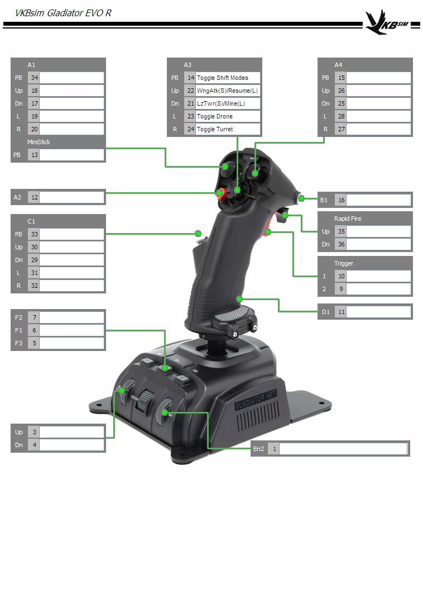

# X4: Foundations VKB Gladiator NTX EVO Configuration

## WARNING

MAKE SURE YOU HAVE BACKUPS OF YOUR VKB CONFIG FILES AND X4 INPUT MAPS BEFORE YOU USE THESE SCRIPTS OR FILES.  THE AUTHOR IS NOT RESPONSIBLE IF YOUR ONE AND ONLY COPY OF A FILE IS RUINED.

## Introduction

This is my personal dual stick configuration of the [VKB Gladiator NTX EVO](https://www.vkbcontrollers.com/) joysticks for [X4: Foundations by Egosoft](https://www.egosoft.com).

This is built around two VKB Gladiator NTX EVO joysticks.  Both sticks use the premium grip.  The right hand stick is in the vertical configuration and used as the main directional stick.  The left hand stick is in the Omni Throttle configuration with the Y axis spring removed.

You should be able to apply them to the opposite hands without needing to modify it first.  If you can't, see the details below on how I've configured the sticks.

## Instructions

### VKB Gladiator NTX Evo

Place the two `VKB*.cfg` in the folder with your VKB software.

Using the VKB configuration software, send the two configuration files to your joysticks.

### X4: Foundations

Place the input map file in your `Egosoft/X4/{random_number}` folder.  Rename the file to `inputmap_#.xml` where the number is a number 1-5.  For best results use a number that is currently not being used by other input maps.

The input map should work both right and left handed as long as you keep the same stick configuration numbers as I do.

Your flight stick should be set as controller 1.

Your throttle stick should be set as controller 2.

In the X4 Controls menu use the Load Profile option to load the new configuration.

## Stick Configurations

The X4 input map and the two VKB configuration files are intended to work together.  I've used the VKB configuration software to enable features such as tempo buttons (long press & short press do different things) and Shift Modes for even more options for the physical buttons.

### Left Hand

I am going to assume that your Y axis spring has been removed and you are using this as a throttle.  In dead center the LED should flash RED.  Outside of dead center it should be solid green.

In the VKB sick configuration I've configured the throttle curve to slow down near center so we have better fine control of the throttle at low speeds like when docking.  It should feel a little "sticky" at zero.

Overall the left hand stick is fairly straight forward.  It focuses on target management and ship mode toggling.  I'm moving left to right as if you are viewing the left hand throttle stick.

Note: The image is a right-handed one, but the HAT configurations should match what is printed on the throttle housing.

#### A4 HAT

The A4 HAT focuses on basic targeting functions.  Pressing up will target objects the same way the `T` key does, so YMMV on how accurate it is.  Pressing the stick in will deselect your target.  Learn to leveraging the guidance toggle and the auto pilot toggle for quick navigation.

- `Press` -- Deselects your target
- `Up` -- Attempts to target what ever is in front of you `T` key style
- `Down` -- Target the nearest enemy
- `Left` -- Toggle AutoPilot
- `Right` -- Toggle Guidance

#### A3 HAT

This center hat is all about ship mode management.  It has got the 4 main ship modes mapped one in each direction.  

Pressing in on the A3 HAT toggles flight assist.  As of the 7.5 Flight Model update I do not use flight assist nearly as much as I used to, but it is here for quick easy access for sick moves.

- `Press` -- Toggle Flight Assist
- `Up` -- Short Range Scan
- `Down` -- Long Range Scan
- `Right` -- SETA

#### A1 HAT

This HAT is focused on advanced targeting options and walking.  Press the stick down to toggle walking mode on and off.  The small circular led will light up red when in walking mode.  The stick should then act like any controller stick in a FPS game.

- `Press` -- Toggle walking mode
- `Up` -- Next Target
- `Down` -- Previous Target
- `Left` -- Next Ship Component
- `Right` -- Previous Ship Component

#### A2 Button

`Short press` this button to stop engines.

`Long press` and hold this button to engage engine boost.

#### B1 Button

Match your target's speed.  Don't forget that this also works while in travel drive!

#### C1 HAT

Currently un-used

#### Rapid Fire Switch

- `Up` -- This will cycle through the secondary fire groups
- `Down` -- This will load the next ammunition (missiles) type

#### Trigger

This is the secondary fire button.  Use this for firing your secondary weapons, and hold when in long range scan mode to charge up the scan ping.  When walking, pull the trigger once to start running.

#### D1 Button

This button will pause the game.

#### F Buttons

- `F2` -- This will cycle through the radar modes
- `F1` -- This will toggle the slow time game option (see the accessibility options for more)
- `F3` -- Quick Save -- USE FREQUENTLY!

#### Sw1

This switch will zoom in and out with the Video Enhancement Goggles

#### Left Stick Diagram

### Right Hand

The right hand stick has a few more things going on.  The primary difference is that there are multiple modes that the A3 HAT can be in.  Each mode tries to group similar function together.

Starting left to right as if we are looking at the stick.

#### A1 HAT

Press in on this hat to enable view mode similar to using a controller in FPS mode.  I personally don't use this much.  I tend to move my hand over to my mouse when walking around.

#### A3 HAT

Press the center of the A3 HAT to cycle between the three modes.

The LED on the stick will light up according to which mode you are in.

- `Mode 1` -- Blue LED
- `Mode 2` -- Green LED
- `Mode 3` -- Red LED

##### Mode 1 BLUE

This is the default mode and is for basic commands.

- `Press` -- Toggle modes
- `Up` -- Stand Up
- `Left` -- Request Docking while flying and Fast Travel when walking

##### Mode 2 Green

This mode is focused around civilian deployment commands.

- `Press` -- Toggle modes
- `Up` -- Launch a resource probe
- `Down` -- Repeat the last civilian deployment
- `Left` -- Launch Navigation Beacon
- `Right` -- Launch Satellite

##### Mode 3 Red

This mode is focused around combat commands.

- `Press` -- Toggle modes
- `Up` -- Short press to have you wingman attack your target, long press to have them resume their duties
- `Down` -- Short press to launch a laser tower, long press to launch a mine
- `Left` -- Toggles Drones
- `Right` -- Toggles Turrets

#### A4 HAT

This HAT is camera controls.  Use it in external view modes.  Press in on the stick to reset the camera to default view.

#### A2 Button

`Hold` for the container magnet.

#### B1 Button

In short range scan mode, scan your target.

Note: There is another long press button mapped in the controller config, but is currently not mapped to anything in the game.

#### C1 HAT

This HAT is for UI interaction.  Press the HAT to select menu items.  Use the directions to move around.  Pressing the HAT will also answer comms requests.

There are one or two menu items that don't want to seem to have their OK button triggered, but I can't figure out why.  You may run into this.

#### Rapid Fire

- `Up`-- Next Primary Fire Group
- `Down` -- Launch Counter Measures

#### Trigger

> __Pew! Pew!__ -- Boso Ta

#### D1 Button

Once you have teleportation unlocked, this will teleport you to your current target (provided you have permission).

#### F Buttons

- `F2` -- Short press for external view.  Long press for Target view.  Short press again to return to cockpit view.
- `F1` -- Comm your target
- `F3` -- If your ship is equipped with a cover mod, this will toggle it

#### En1

(It says En2 in the diagram for some reason)

This controls the camera zoom level when in external or target view.

#### Right Stick Diagrams

Mode 1

Mode 2

Mode 3

## Changelog

- 2025.06.21 -- Updated for 7.6
  - __UPDATE__ Capture tweaks from the last year
  - __NEW__ -- VKB Diagrams
  - __CHANGE__ -- Overhaul README
- 2024.07.09 -- And they call it a mine!
  - `[VKB] [FS]` Added a boolean for virtual button 53 so that it is now a tempo button in Shift Mode 2 (combat)
  - `[X4] [FS]` Added short down press in combat mode to deploy laser tower
  - `[X4] [FS]` Added long down press in combat mode to deploy mines
- 2024.07.08
  - `[VKB] [FS]` Fixed the `A4 hat` camera control in combat shift mode, the camera now works during "pew pew" time.
  - `[X4]` Removed `R` and `side mouse` bindings to secondary fire
  - `[X4] [FS]` Added aim assist toggle, I do not remember why I did this...but it is apparently there in the diff ¯\_(ツ)_/¯
- 2024.06.22 -- Eureka Update
  - When the 7.0 beta dropped, the first person look on the right stick broke and I couldn't figure out why.  What stumped me further was that switching back to 6.2 off the beta fixed everything.  Well I finally think I figured it out, there's a conflict once I try to map the camera controls to the same `A1 hat`.  So I've moved camera control to the `A2 hat`.  It was sitting unused.  This may still be a temporary move, but at least my first person look is now working again.
  - `[X4] [FS]` Moved Camera controls to `A4 hat`. Center click to reset camera
  - `[X4] [FS]` Added Wingman Resume Duties to Mode 00 `Down`
  - `[X4] [FS]` Added Repeat last civilian deployment to Mode 01 `Down`
  - `[X4] [TS]` Added Toggle Game Speed (Slow-mo mode) to `F1`
- 2024.06.22 -- 7.0 Update Compatibility
  - Rebuilt the entire input map from the new Egosoft VKB defaults
  - `[VKB] [FS]` Added tempo button to `F1`
  - `[X4] [FS]` Moved main interaction button from `A2` to `C2 HAT` button press
  - `[X4] [FS]` Added Short Press `F1` external/internal camera toggle
  - `[X4] [FS]` Added Long Press `F1` target external camera (short press returns to internal view)
  - `[X4] [TS]` Added `F3` Quicksave
  - `[X4] [TS]` Added `SW1` Video enhancement goggles `Up` to zoom in, `Down` to zoom out
- 2024.02.09 -- Fixed some incorrect button mapping in the 3rd shift mode
- 2024.01.28 -- Initial Release
